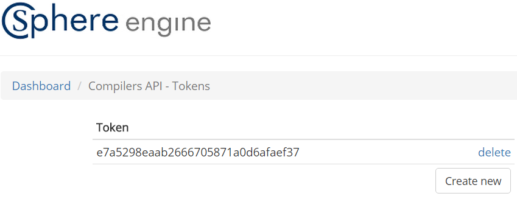

=======================
Sphere Engine Compilers
=======================

What is it?
=============

Sphere Engine Compilers is a webservice which allows you remotely use compilers and interpreters. We support vast numbers of languages starting from the most common ones like C++, Java and Python and ending with much more exotic ones like Falcon, Lua and Oz. 

Sphere Engine Compilers API allows you to:
 * upload a source code,
 * run the program with input data on the server side,
 * download results of the execution (output, standard error, compilation information, execution time, memory usage, etc.).

How it works?
=============

Getting started
----------------

The service is available under *http://api.compilers.sphere-engine.com/api/v3/* link. The API is documented in the proper :ref:`section <compilers-section-api>`. First you need to generate *access_token* from `Token manager <http://sphere-engine.com/services/1/auth>`_:

As you can see it's possible to create many tokens or delete no longer needed ones.

Access token allows you to use the service without using your account login and password. You can safely keep your access token in repositories visible for your developers team while your Sphere Engine account is available only for you. 

If you suspect that access token leaked and it is no loger safe to use it you can simply replace it with the new one. In addition you can maintain many access token for different projects.

Sending requests
----------------

Follow the example of sending request to the service:

.. code-block:: cpp

    curl -H "Content-Type: application/json" -X POST
    -d '{
        "language":"1",
        "sourceCode":"#include<stdio.h> int main(){ printf("Hello!"); return 0; }"
        }'
    "http://api.compilers.sphere-engine.com/api/v3/submissions?access_token=e7a5298eaab2666705871a0d6afaef37"

We assumed that generated access token is *e7a5298eaab2666705871a0d6afaef37*. You can use any program which allows you to send valid HTTP requests, we chose *curl* which should be available in every operating system from UNIX family. Demonstrated example sends simple source code which is going to be compiled using compiler of id = 1. 

Full list of languages can be fetched also using the service under the link *http://api.compilers.sphere-engine.com/api/v3/languages*. Identifiers of languages are permanent thus you can fetch them once.

After sending a request you will get response which, in this case, will be your submission id. For example:

.. code-block:: cpp

    {
        "id": 101
    }

Check results
-------------

After sending a request you need to wait a bit for its execution. The results of the execution are obtainable using GET request with proper submission id.

.. code-block:: cpp

    curl -H "Content-Type: application/json"
        "http://api.compilers.sphere-engine.com/api/v3/submissions/101?access_token=e7a5298eaab2666705871a0d6afaef37"

Possible result will be like this:

.. code-block:: cpp

    {
        "error": "OK",
        "status": 0,
        "result": 13,
    }

It's possible to receive much more details using additional parameters (see :ref:`API section <compilers-section-api>`).

.. _compilers-section-api:

API
===

tu dokumentacja API