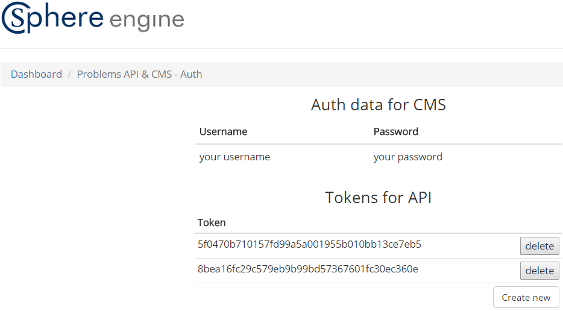
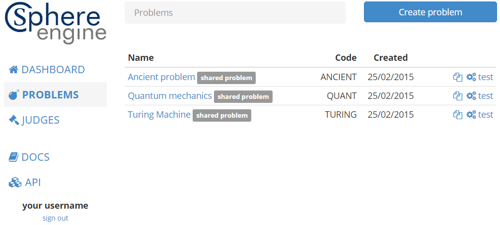
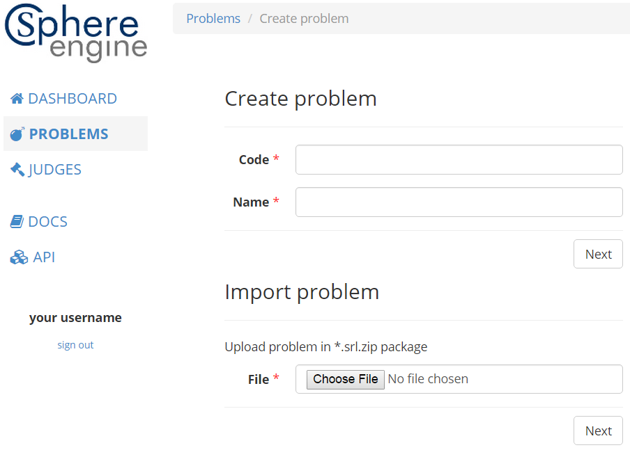
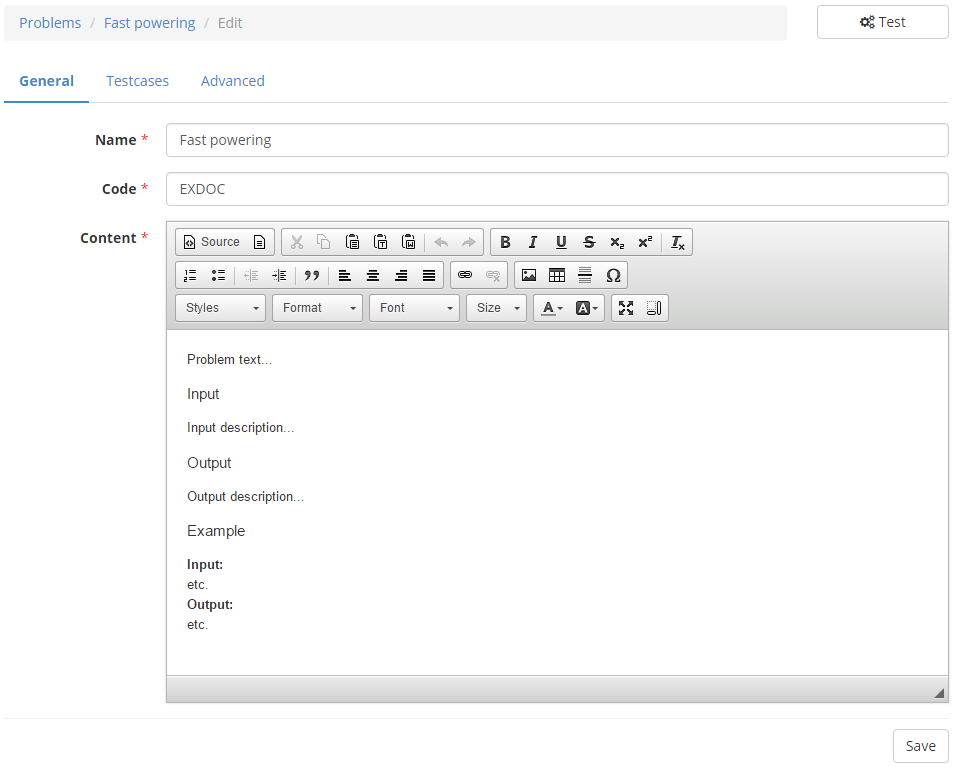
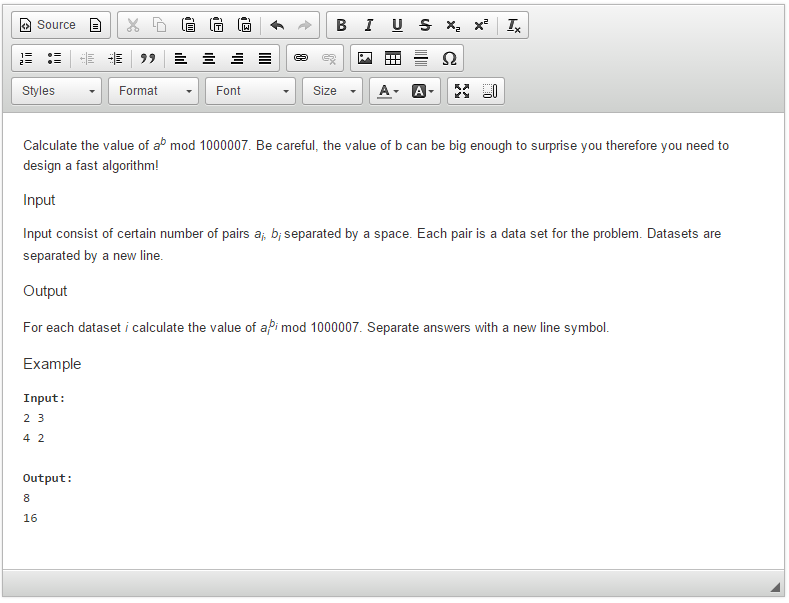
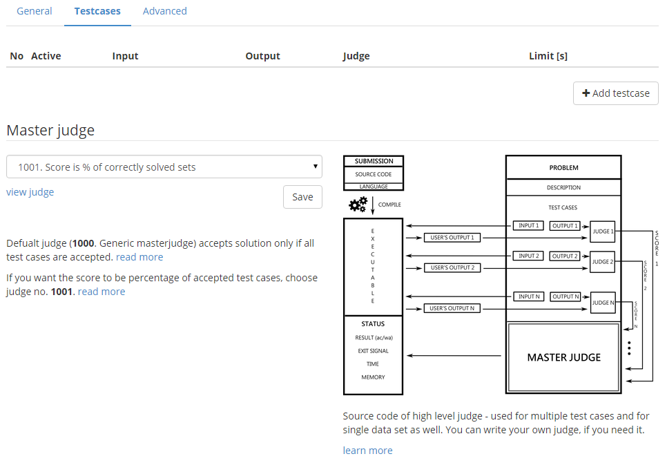
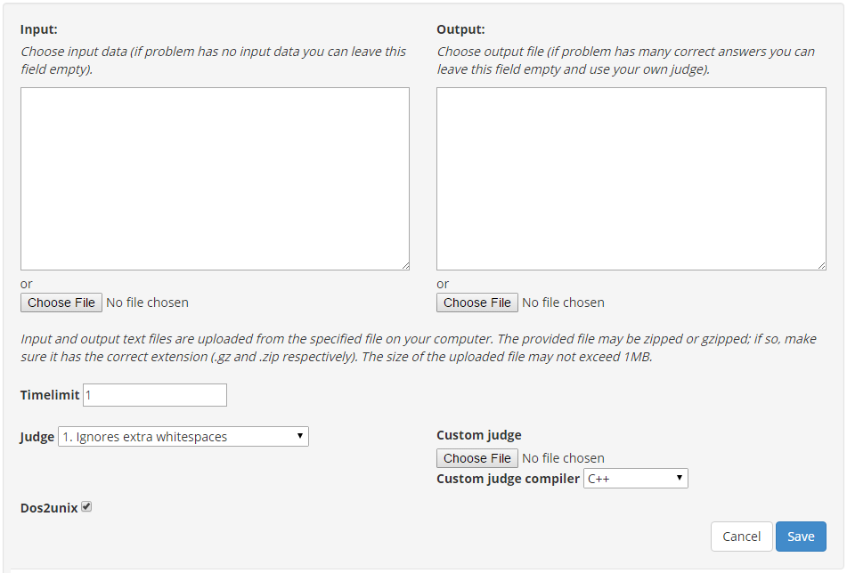
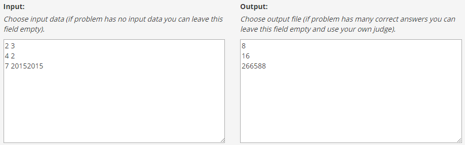

======================
Sphere Engine Problems
======================

What is it?
=============

Sphere Engine Problems is a platform which allows you to remotely manage and use a set of programming problems. You can prepare a set of programming task as well as send and try correctness of its solutions in over 60 programming languages. It is available from internet browser for management. 

We offer a webservice which can be used to build your own programming platform for recruitment, programming events, education and more.

Sphere Engine Problems API allows you to:
 * create and modify problems,
 * submit a solution to the problem with one of more than 60 languages,
 * run the program with model input data on the server side,
 * download results of the execution (correctness status, execution time, consumed memory and much more technical details)

How it works?
=============

Getting started
----------------

The service is available under *https://problems.sphere-engine.com/api/v3/* link. The API is documented in the proper :ref:`section <problems-section-api>`. First you need to generate *access_token* from `Token manager <http://sphere-engine.com/services/1/auth>`_:

As you can see it's possible to create many tokens or delete no longer needed ones.

Access token allows you to use the service without using your account login and password. You can safely keep your access token in repositories visible for your developers team while your Sphere Engine account is available only for you. 

If you susspect that access token leaked and it is no loger safe to use it you can simply replace it with the new one. In addition you can maintain many access token for different projects.

It is also possible to create the new access token using the service:

.. code-block:: cpp

    curl -H "Content-Type: application/json" -X POST
        -d '{
            "username":"YOUR-USERNAME",
            "password":"YOUR-PASSWORD"
        }'
        "https://problems.sphere-engine.com/api/v3/auth"

You can use any program which allows you to send valid HTTP requests, we chose *curl* which should be available in every operating system from UNIX family. 

Example response:

.. code-block:: cpp

    {
        "access_token": "a1b2f42e09b4adbff38f736fe52882a574592687",
        "token_type": "Bearer",
        "expires_in": 2592000
    }

.. _problems-subsection-sendingrequest:

Sending requests
----------------

Follow the example of sending request to the service:

.. code-block:: cpp

    curl -H "Content-Type: application/json" -X POST
    -d '{
        "problemCode":"TEST"
        "languageId":"1",
        "source":"#include<stdio.h> int main(){ int a; while(1){ scanf(\"%d\", &a); if(a==42) break; printf(\"%d \", a); } return 0; }"
        }'
    "https://problems.sphere-engine.com/api/v3/submissions?access_token=a1b2f42e09b4adbff38f736fe52882a574592687"

Demonstrated example sends a solution to the TEST problem which is written using language of id = 1. 

Full list of languages can be fetched also using the service under the link *https://problems.sphere-engine.com/api/v3/languages*. Identifiers of languages are permanent thus you can fetch them once.

After sending a request you will get response which, in this case, will be your submission id. For example:

.. code-block:: cpp

    {
        "submissionId": 101
    }

Check results
-------------

After sending a request you need to wait a bit for its execution. The results of the execution are obtainable using GET request with proper submission id.

.. code-block:: cpp

    curl -H "Content-Type: application/json"
        "https://problems.sphere-engine.com/api/v3/submissions/101?access_token=a1b2f42e09b4adbff38f736fe52882a574592687"

Possible result will be like this:

.. code-block:: cpp

    {
        "id":101,
        "language":1,
        "status":15,
        "statusDescription":"accepted",
        "result_score":0,
        "result_time":0,
        "result_memory":2632,
        (...)
     }

Quick start
===========

Problems
--------

Main view on the problems page consist of a list of the problems available for you. From this view you have fast access to the testing and cloning problems.

We offer a certain number of problems which can be used for your purpose. If the offer is insufficient you can create unlimited number of your own problems.

Creating problems
~~~~~~~~~~~~~~~~~

Detailed desription of creating problems is covered by our handbook [TODO LINK]. However the content of the handbook is independent of the interface due to the fact it covers issues in many of Sphere Research projects. We present building new problem in the Sphere Engine Problems context.

Creating new problem is devided into steps. First of all you need to name your problem and pick his unique code:

.. note::
    You can also import previously exported problem (from Sphere Engine Problems but also from, for example, `spoj.com <http://spoj.com>`_.

.. warning::
    Once you choose the code for your problem's code it cannot be changed due to our technical solutions.

After pressing *Next* button you will be able to prepare description of the problem.

You can save your changes at any time by pressing *Save* button below the textarea. Designed description should be similar to the following one:

We have covered all *General* settings tab. Another tab is dedicated to testcases.

.. note::
    The idea of testcases is crucial for online judging. You can get familiar with this concept in our handbook [LINK].

There are two possible actions on *Testcases* tab:
 * Add testcase
 * Choose masterjudge (we leave it on default choice)

Let us focus on adding testcases. After pressing the button *Add testcase* you will see another form:

Let us fill it with some basic and non-exhaustive data:

We can leave rest of options on their default values and press *Save* button.

.. note::
	The new problem is ready to use. Although it is a good habit to make a test by pressing *Test* button and sending correct answer to the problem.

You can use your problem from the level of webservice similarily to the example presented in :ref:`sending request subsection <problems-subsection-sendingrequest>`.

.. _problems-section-api:

API
===